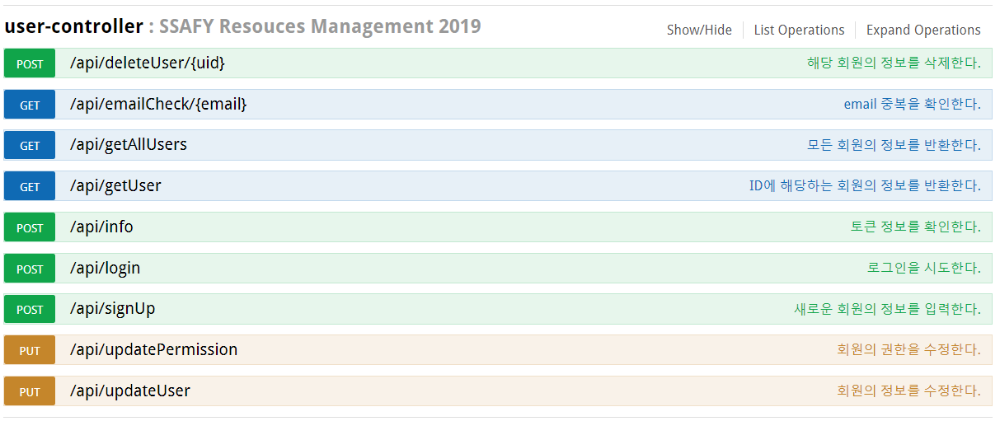
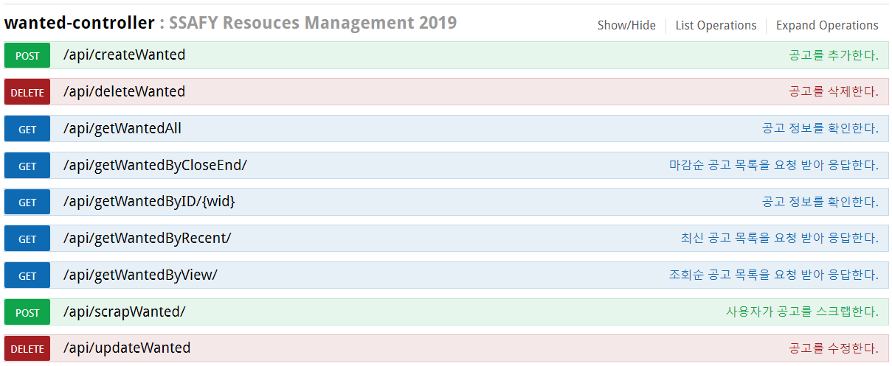

# API 명세

# 회원(User)

* API

  

## 1. 회원가입(C) 

1. `POST /api/signUp` : 새로운 회원의 정보를 DB에 저장한다.

   - Parameter : User

     ```json
     {
       "email": "string",	//id 겸 이메일
       "pw": "string",		//비밀번호
       "uname": "string"		//이름
     }
     ```
     
     * 필수 :  `email`, `pw`, `uname` 만 입력받아 회원가입 한다.
     
   - Return : UserResult
   
     ```json
     {
       "msg": "string",		//결과 정보
       "state": "string"		//상태 (success / fail)
     }  
     ```
   
2. `GET /api/emailCheck/{email}` : 입력한 email이 사용가능 한지 중복 체크

   - Parameter : String

   - Return : `email` 중복 유무에 대한 결과를 반환한다.

     ```json
     {
       "msg": "string",		
       "state": "string"		
     }
     ```

## 2. 로그인(R)

* `POST /api/login` : 로그인을 시도한다.

  * Parameter : User

    ```json
    {
      "email": "string",
      "pw": "string"
    }
    ```

    * 필수 : `email`, `pw`

  * Return : UserResult

    ```json
    {
      "msg": "string",		
      "state": "string"		
    }
    ```

    

## 3. 회원 탈퇴(D)

* `DELETE /api/deleteUser/{uid}` : 해당 uid를 가진 회원의 정보를 삭제한다.

  * Parameter : integer

  * Return : UserResult

    ```json
    {
      "msg": "string",		
      "state": "string"	
    }
    ```

    

## 4. 회원 목록(R)

* `GET /api/getAllUsers` : 전체 회원의 목록을 확인한다.

  * Parameter : {}

  * Return : 전체 회원의 목록 `List` 를 반환

    ```json
    [
      {
        "uid": 1,
        "email": "admin@it.da",
        "uname": "어드민",
        "auth": 0,
        "major": null,
        "uimg": null,
        "cid": 0				//취업한 기업id
      },
      {
    	...
      }
    ]
    ```

    

## 5. 회원 상세(R)

* `GET /api/getUser/{uid}` : uid에 해당하는 회원의 정보를 반환한다.

  * Parameter : Integer

  * Return : UserResult

    ```json
    {
      "msg": "string",		
      "state": "string"
    }
    ```

    

## 6. 회원 정보 수정(U)

* `UPDATE /api/updateUser` : 회원의 정보를 수정한다.

  - Parameter : User

    ```json
    {
      "uid": 0, 
      "auth": 0,
      "cid": 0,
      "email": "string",
      "major": "string",
      "pw": "string",
      "uid": 0,
      "uimg": "string",
      "uname": "string"
    }
    ```

    - 필수 : `uid`, `pw`, `uname`
    - `uid`, `email`, `auth`는 변경이 불가능하다.
    - `pw`, `major`, `uimg`, `uname` 변경 가능

  - Return : UserResult

    ```json
    {
      "msg": "string",		
      "state": "string"
    }
    ```

    

## 7. 토큰 정보 확인

* `POST /api/info` : 토큰이 유효한지 검사한다.

## 8. 회원 권한 수정(U)

> 관리자만 가능

* `UPDATE /api/updatePermission` : uid에 해당하는 회원의 권한을 수정한다.
  * Parameter : User
    * 필수 : `uid`, `auth`
  * return : UserResult

--------------------

# 기업(Company)

* API

  

## 1. 기업 생성(C)

> 관리자만 가능

* `POST /api/createCompany` : 새로운 기업 정보를 생성한다.

  * Parameter : Company

    ```json
    {
      "busiCont": "string",		//주요 사업내용
      "busiSize": "string",		//기업규모
      "corpAddr": "string",		//회사 주소
      "corpNm": "string",		//회사명
      "homePg": "string",		//회사 홈페이지
      "logo": "string",			//기업 로고
      "totPsncnt": "string",	//근로자수
      "yrSalesAmt": "string"	//연매출액
    }
    ```

    * 필수 : `corpNm`

  * Return : Result

## 2. 기업 수정(U)

> 관리자만 가능

* `PUT /api/updateCompany` : 기업 정보를 수정한다.

  * Parameter : Company

    ```json
    {
      "cid": 0, 
      "busiCont": "string",		
      "busiSize": "string",		
      "corpAddr": "string",		
      "corpNm": "string",		
      "homePg": "string",		
      "logo": "string",			
      "totPsncnt": "string",	
      "yrSalesAmt": "string"	
    }
    ```

    * 필수 : `cid`, `corpNm`

  * Return : Result

## 3. 기업 삭제(D)

> 관리자만 가능

# 직무(Job)

* API

  

## 1. 직무 생성(C)

> 관리자만 가능

* `POST /api/createJob` 

  * Parameter : Job

    ```json
    {
      "extra": "string",	//우대사항
      "jdetail": "string",	//직무 상세
      "jname": "string",	//직무명
      "jtype": "string",	//고용형태(계약직, 정규직, ...)
      "place": "string",	//근무지
      "require": "string",	//자격요건
      "to": "string",		//모집인원
      "wid": 0				//공고id - FK
    }
    ```

    * 필수 : `to`, `jname`, `wid`

  * Return : Result

    ```json
    {
      "msg": "string",
      "state": "string"
    }
    ```

    

## 2. 직무 수정(U)

> 관리자만 가능

* `PUT /api/updateJob`

  * Parameter : Job

    ```json
    {
      "jid": 0,				//직무 id
      "extra": "string",	//우대사항
      "jdetail": "string",	//직무 상세
      "jname": "string",	//직무명
      "jtype": "string",	//고용형태(계약직, 정규직, ...)
      "place": "string",	//근무지
      "require": "string",	//자격요건
      "to": "string",		//모집인원
      "wid": 0				//공고id - FK
    }
    ```

    * 필수 : `jid`,  `to`, `jname`

  * Return : Result

## 3. 직무 삭제(D)

> 관리자만 가능

* `DELETE /api/deleteJob`
  * Parameter : Integer
  * Return : Result

# 스터디(Study)

* API

  ######### swagger 추가

## 1. 스터디 생성(C)

> 스터디 생성은 회원만 가능하다.

* `POST /api/createStudy` 

  * Parameter : Study

    ```json
    
    ```
    
    * 필수 : `stname`, `maxPcnt`, `pcnt`, `stype`, `sgroup`, `content`, `captain`
    
  * Return : Result

    ```json
  {
      "msg": "string",
    "state": "string"
    }
    ```
  
    

## 2. 스터디 상세 조회(R)

> 방문자, 회원, 관리자 모두 가능

* `get /api/getStudy/{stid}`
* Parameter : Integer
  
* Return : Result

## 3. 스터디 삭제(D)

> 스터디 삭제는 스터디장 + 관리자만 가능하다.

* `DELETE /api/deleteStudy/{stid}` : 해당 `stid`인 스터디를 삭제한다.
  * Parameter : Integer
  * Return : Result

## 4. 스터디 목록(R)

> 목록은 방문자, 회원 모두 가능하다.

* `get /api/getAllStudy` : 모든 스터디 리스트를 불러온다.
  * Parameter : {}
  * Return : `List <Study>`

# 스터디 그룹(StudyGroup)

* API

## 1. 스터디 가입(C)

> 회원만 가입 가능하다.

* `POST /api/createStudyGroup` 

  * Parameter : StudyGroup

    ```json
    
    ```

    * 필수 : `stid`, `uid`

  * Return : Result

    ```json
    {
      "msg": "string",
      "state": "string"
    }
    ```

    

  

## 2. 스터디 멤버 보기 (R)

> 방문자, 회원 모두 가능하다.

* `get /api/getStudyGroup/{stid}` :  `stid`에 해당하는 스터디의 멤버를 반환한다.

  * Parameter : stid

  * Return : `List <UserResult>`

    ```json
    
    ```

    

## 3. 스터디 탈퇴(D)

> 스터디 멤버들만 탈퇴 가능
>
> 스터디 장이 탈퇴시 스터디는 없어진다. 

* `DELETE /api/deleteStudyGroup/` : 해당 `stid`인 스터디의 `uid`를 가진 멤버를 삭제한다.

  * Parameter : StudyGroup

    ```json
    
    ```

    

  * Return : Result

    ```json
    
    ```

    

# 공고

* API

  

## 1. 공고 입력(C)

 1. `POST /api/createWanted` : 새로운 공고를 DB에 저장하여 추가한다.

    - Parameter : Wanted

      ```json
      {
        "wantedTitle": "string",	//공고 제목
        "startDate": "string",	//공고 시작일(timestamp) 2020.01.30 00:00
        "endDate": "string",		//공고 마감일(timestamp) 2020.02.14 18:00
        "process": "string",		//채용 과정(이미지링크 or text)
        "etc": "string",			//기타 유의사항
        "question": "string",		//문의 사항
        "cid": 0					//채용 공고 작성 기업(fk)
      }
      ```

      - 필수 :  wantedTitle, startDate, endDate, process, cid

    - Return : 공고 입력 성공 유무에 대한 결과를 반환 Result

      ```json
      {
          "msg" : "string",		//결과 정보
          "state" : "string"		//상태 (success / fail)
      }
      ```

      

## 2. 공고 삭제(D)

1. `DELETE /api/deleteWanted` : 공고를 삭제한다.

   - Parameter : int

     ```json
     wid : 0			//공고 ID(pk)
     ```

     - 필수 : wid

   - Return : 공고가 삭제 되었는지 성공 유무에 대한 결과를 반환 Result

     ```json
     {
         "msg" : "string",		//결과 정보
         "state" : "string"		//상태 (success / fail)
     }
     ```


## 3. 메인 페이지(R)

1. `GET /api/getWantedAll` : 전체 공고 목록을 반환한다.

   - Parameter : null

   - Return : 전체 공고 목록의 리스트를 반환한다. List<WantedResult>

     ```json
     [
       {
         "company": {					//기업 정보
           "cid": 0,							//기업 id
           "corpNm": "string",				//기업명
           "totPsncnt": "string",			//사원 수
           "busiSize": "string",				//기업규모
           "yrSalesAmt": "string",			//연매출
           "corpAddr": "string",				//기업주소
           "homePg": "string",				//홈페이지주소
           "busiCont": "string",				//주요사업내용(업종)
           "logo": "string"					//기업로고(이미지)
         },
         "wanted": {						//공고 정보
           "wid": 0,
           "wantedTitle": "string",
           "active": 0,
           "startDate": "string",
           "endDate": "string",
           "process": "string",
           "etc": "string",
           "question": "string",
           "vcnt": 0,
           "cid": 0
         },
         "jobs": [						//각 공고별 직무정보 리스트
           {
             "jid": 0,						//직무id
             "to": "string",					//모집인원
             "jname": "string",				//직무명
             "jdetail": "string",			//주요업무
             "jtype": "string",				//채용형태
             "require": "string",			//자격요건
             "extra": "string",				//우대사항
             "place": "string",				//근무지
             "wid": 0,						//공고id(fk)
             "stacks": [						//직무 별 기술 스택 리스트
               {
                 "sid": 0,						//기술스택id
                 "tname": "string",				//기술스택 명
                 "cnt": 0						//기술스택 사용수(추후업데이트)
               },
               {	...	}
             ]
           },
           {	...	}
         ],
         "stacks": [						//공고에서 쓰이는 기술 스택 리스트
           {
             "sid": 0,
             "tname": "string",
             "cnt": 0
           },
           {	...	}
         ],
         "scrap": false					//(로그인한 유저의) 스크랩 유무
       },
       {	... }
     ]
     ```

     

2. `GET /api/getWantedByCloseEnd` : 공고의 마감일이 빠른 순으로 10개의 공고 목록을 반환한다.

   - Parameter : null
   - Return : 마감일 순 10개의 공고 목록 반환 List<WantedResult>

3. `GET /api/getWantedByRecent` : 가장 최근에 등록된 24개의 공고 목록을 반환한다.

   - Parameter : null
   - Return : 가장 최근에 등록된 24개의 공고 목록 반환 List<WantedResult>

4. `GET /api/getWantedByView` : 많은 조회수 순으로 10개의 공고 목록을 반환한다.

   - Parameter : null
   - Return : 조회수가 높은 순으로 10개의 공고 목록 반환 List<WantedResult>

5. `GET /api/getWantedByStack` : (로그인 한 유저의) 기술 스택에 맞는 10개의 공고 목록을 반환한다.

   - HttpServletRequest : JWT( Http- Header )
   - Parameter : null
   - Return : 사용자의 기술 스택에 맞는 10개의 공고 목록 반환 List<WantedResult>

6. `GET /api/getWantedByScrap` : (로그인 한 유저의) 스크랩한 공고 중 마감일이 빠른 순으로 10개의 공고 목록을 반환한다.

   - HttpServletRequest : JWT( Http-Header )
   - Parameter : null
   - Return : 사용자가 스크랩한 공고 중 마감일이 빠른 순으로 10개의 공고 목록을 반환한다.


## 4. 공고 상세보기(RU)

1. `GET /api/getWantedByID/{wid}` : 특정 공고의 상세 정보를 반환한다.

   - Parameter : int

     ```json
     wid : 0
     ```

   - Return : wid에 해당하는 공고의 상세 정보를 반환한다. WantedResult

     ```json
     {
       "company": {					//기업 정보
         "cid": 0,						//기업 id
         "corpNm": "string",				//기업명
         "totPsncnt": "string",			//사원 수
         "busiSize": "string",			//기업규모
         "yrSalesAmt": "string",			//연매출
         "corpAddr": "string",			//기업주소
         "homePg": "string",				//홈페이지주소
         "busiCont": "string",			//주요사업내용(업종)
         "logo": "string"				//기업로고(이미지)
       },
       "wanted": {						//공고 정보
         "wid": 0,
         "wantedTitle": "string",
         "active": 0,
         "startDate": "string",
         "endDate": "string",
         "process": "string",
         "etc": "string",
         "question": "string",
         "vcnt": 0,
         "cid": 0
       },
       "jobs": [						//각 공고별 직무정보 리스트
         {
           "jid": 0,						//직무id
           "to": "string",				//모집인원
           "jname": "string",			//직무명
           "jdetail": "string",			//주요업무
           "jtype": "string",			//채용형태
           "require": "string",			//자격요건
           "extra": "string",			//우대사항
           "place": "string",			//근무지
           "wid": 0,						//공고id(fk)
           "stacks": [					//직무 별 기술 스택 리스트
             {
               "sid": 0,						//기술스택id
               "tname": "string",			//기술스택 명
               "cnt": 0						//기술스택 사용수(추후업데이트)
              },
              {	...	}
            ]
          },
          {	...	}
        ],
        "stacks": [						//공고에서 쓰이는 기술 스택 리스트
          {
            "sid": 0,
            "tname": "string",
            "cnt": 0
          },
          {	...	}
        ],
        "scrap": false					//(로그인한 유저의) 스크랩 유무
     }
     ```

2. `POST /api/scrapWanted` : 스크랩 유무에 따라 스크랩 설정/해제 기능을 수행

   - HttpServletRequest : JWT(HTTP-Header)

   - Parameter : null

   - return : 스크랩 유무에 따른 스크랩 설정/해제 결과를 반환 Result

     ```json
     {
         "msg" : "string",
         "state" : "string",
         "scrap" : false
     }
     ```

     

## 5. 공고 수정(U)

1. `PUT /api/updateWanted` : 공고의 정보를 수정한 결과를 반환한다.

   - Parameter : Wanted

     ```json
     {
       "active": 0,
       "cid": 0,
       "endDate": "string",
       "etc": "string",
       "process": "string",
       "question": "string",
       "startDate": "string",
       "wantedTitle": "string",
       "wid": 0
     }
     ```

   - Return :  수정 결과를 반환 Result

     ```json
     {
         "msg" : "string",
         "state" : "string"
     }
     ```

     

